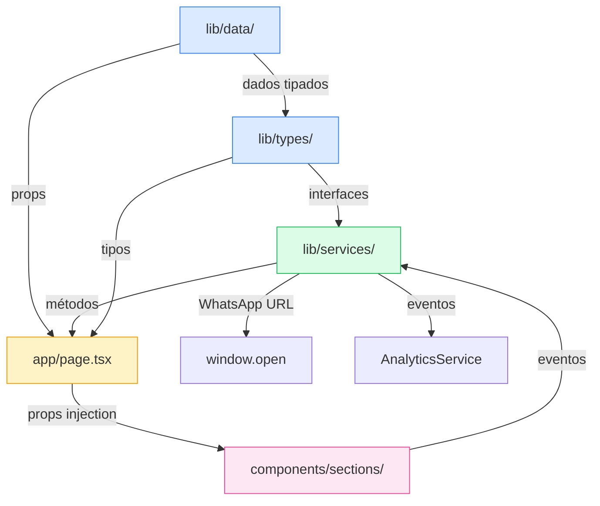

<div align="center">

# 🏗️ Mandure Serviços

### Landing Page Institucional — Empreiteira Premium

[](https://nextjs.org/)
[](https://www.typescriptlang.org/)
[](https://tailwindcss.com/)
[](https://www.framer.com/motion/)
[](https://playwright.dev/)
[](https://www.docker.com/)

[](https://github.com/bieltrue95/mandure-servicos/actions/workflows/ci.yml)
[](https://github.com/bieltrue95/mandure-servicos/actions/workflows/playwright.yml)

> Plataforma digital de conversão e showcase premium de projetos para
> empreiteira. Desenvolvida com foco em **performance extrema**, **SEO técnico
> completo** e **experiência visual imersiva** que transmite solidez e
> confiança.

</div>

---

## 📋 Sumário

- [Sobre o Projeto](#-sobre-o-projeto)
- [Stack Tecnológica](#-stack-tecnológica)
- [Arquitetura](#-arquitetura)
  - [Camadas da Aplicação](#camadas-da-aplicação)
  - [Fluxo de Dados](#fluxo-de-dados)
  - [Server vs Client Components](#server-vs-client-components)
  - [Design Patterns](#design-patterns)
  - [Sistema de Design Tokens](#sistema-de-design-tokens)
  - [Arquitetura de Performance](#arquitetura-de-performance)
  - [Arquitetura de SEO](#arquitetura-de-seo)
- [Estrutura de Arquivos](#-estrutura-de-arquivos)
- [Seções da Landing Page](#-seções-da-landing-page)
- [Componentes UI](#-componentes-ui)
- [Sistema de Dados](#-sistema-de-dados)
- [Serviços e Integrações](#-serviços-e-integrações)
- [Design System](#-design-system)
- [Guia de Manutenção](#-guia-de-manutenção)
  - [Adicionar Nova Seção](#1-adicionar-nova-seção)
  - [Atualizar Dados de Conteúdo](#2-atualizar-dados-de-conteúdo)
  - [Adicionar Projeto ao Portfólio](#3-adicionar-projeto-ao-portfólio)
  - [Modificar Design Tokens](#4-modificar-design-tokens)
  - [Criar Novo Componente UI](#5-criar-novo-componente-ui)
  - [Adicionar Novo Serviço](#6-adicionar-novo-serviço)
- [Desenvolvimento Local](#-desenvolvimento-local)
- [Testes](#-testes)
- [Performance](#-performance)
- [SEO e Metadados](#-seo-e-metadados)
- [Deploy](#-deploy)
  - [Vercel](#vercel)
  - [Docker](#docker)
- [CI/CD](#-cicd)
- [Git Flow](#-git-flow)
- [Documentação Completa](#-documentação-completa)
- [Licença](#-licença)

---

## 🏢 Sobre o Projeto

A **Mandure Serviços** é uma empreiteira especializada em construção civil,
reformas, manutenção predial e obras especiais no estado de São Paulo. Esta
landing page foi concebida como uma **ferramenta de negócio** — não apenas uma
vitrine — com conversão para WhatsApp como objetivo central.

### Resumo Executivo

- **Contexto**: Necessidade de presença digital premium para transmitir
  credibilidade e gerar contatos qualificados.
- **Objetivo**: Construir uma landing page com foco em conversão, performance,
  SEO técnico e manutenção simples.
- **Execução**: Arquitetura modular em Next.js, componentes reutilizáveis,
  dados tipados, monitoramento e testes E2E com Playwright.
- **Resultado**: Plataforma moderna e escalável, preparada para evolução
  contínua e geração de leads.

### Objetivos de Negócio

| Objetivo                         | Implementação                                                   |
| -------------------------------- | --------------------------------------------------------------- |
| Transmitir credibilidade premium | Design com paleta Bronze, tipografia forte, animações suaves    |
| Converter visitantes em leads    | WhatsApp button flutuante, CTAs estratégicos em todas as seções |
| Showcasing de projetos           | Portfolio filtrável com galeria modal de fotos por obra         |
| Construir autoridade             | Seção de certificações (CREA-SP, CBIC, ISO 9001, PBQP-H)        |
| SEO local (São Paulo)            | JSON-LD LocalBusiness, sitemap, robots.txt, OG metadata         |
| Performance mobile               | PWA, AVIF/WebP, responsive em 5 breakpoints                     |

### Métricas Alvo

| Métrica                        | Meta         |
| ------------------------------ | ------------ |
| Lighthouse Performance         | > 90         |
| LCP (Largest Contentful Paint) | < 2.5s       |
| CLS (Cumulative Layout Shift)  | < 0.1        |
| FID / INP                      | < 100ms      |
| Acessibilidade                 | WCAG 2.1 AA  |
| Bundle JS inicial              | < 150kb gzip |

---

## 🛠️ Stack Tecnológica

| Tecnologia                | Versão | Papel no Projeto                                           |
| ------------------------- | ------ | ---------------------------------------------------------- |
| **Next.js**               | 15     | Framework React com App Router, SSR, otimização de imagens |
| **React**                 | 18.3   | Biblioteca de UI, Server/Client Components                 |
| **TypeScript**            | 5.3    | Type safety strict mode, contratos entre módulos           |
| **Tailwind CSS**          | 3.4    | Estilização utility-first integrada ao design system       |
| **Framer Motion**         | 11     | Animações com GPU acceleration, scroll-triggered           |
| **Radix UI**              | latest | Componentes acessíveis (Tabs, Dialog, primitives)          |
| **lucide-react**          | latest | Ícones SVG consistentes e tree-shakeable                   |
| **clsx + tailwind-merge** | latest | Composição condicional de classes CSS                      |
| **Playwright**            | 1.59   | Testes E2E em 6 projetos (mobile + desktop)                |
| **ESLint**                | latest | Linting com regras Next.js + TypeScript                    |
| **Prettier**              | latest | Formatação de código consistente                           |
| **Husky + lint-staged**   | latest | Pre-commit hooks de qualidade                              |
| **Docker**                | latest | Containerização multi-stage                                |

---

## 🏛️ Arquitetura

### Camadas da Aplicação

O projeto implementa uma **arquitetura em 5 camadas** com separação clara de
responsabilidades:

```
┌─────────────────────────────────────────────────────────┐
│  CAMADA DE APLICAÇÃO  →  app/                           │
│  Entry points, metadata, routing, SEO                    │
├─────────────────────────────────────────────────────────┤
│  CAMADA DE APRESENTAÇÃO  →  components/                 │
│  Seções da landing page, UI components                   │
├─────────────────────────────────────────────────────────┤
│  CAMADA DE NEGÓCIO  →  lib/services/                    │
│  WhatsAppService, AnalyticsService                       │
├─────────────────────────────────────────────────────────┤
│  CAMADA DE CONTRATO  →  lib/types/ + lib/constants/     │
│  Interfaces, Enums, configurações                        │
├─────────────────────────────────────────────────────────┤
│  CAMADA DE DADOS  →  lib/data/                          │
│  Mock data tipado, fonte única da verdade               │
└─────────────────────────────────────────────────────────┘
```

### Fluxo de Dados



**Regra fundamental**: Os dados fluem de forma **unidirecional** — da camada de
dados até os componentes via props. Componentes nunca buscam dados diretamente;
recebem tudo via props do `app/page.tsx`.

### Server vs Client Components

| Arquivo                    | Tipo                                   | Razão                                         |
| -------------------------- | -------------------------------------- | --------------------------------------------- |
| `app/layout.tsx`           | **Server Component**                   | Metadata, JSON-LD, fonts — sem interatividade |
| `app/page.tsx`             | **Client Component**                   | Composição das seções, lazy loading dinâmico  |
| `components/sections/*/`   | **Client Components** (`'use client'`) | Framer Motion exige acesso ao DOM e hooks     |
| `components/ui/button.tsx` | **Server-compatible**                  | Sem estado, sem hooks                         |
| `components/ui/tabs.tsx`   | **Client Component**                   | Radix UI usa estado interno                   |
| `lib/services/*`           | **Isomórfico**                         | Funciona em server e client                   |
| `app/robots.ts`            | **Server**                             | Geração de robots.txt                         |
| `app/sitemap.ts`           | **Server**                             | Geração de sitemap XML                        |

### Design Patterns

#### 1. Service Layer com Classes Estáticas

Encapsula integrações externas com interface limpa e testável:

```typescript
// lib/services/whatsapp.service.ts
WhatsAppService.generateUrl(phone, message);
WhatsAppService.open(phone, message);
WhatsAppService.generateBudgetMessage(projectType);
WhatsAppService.isValidBrazilianNumber(phone);

// lib/services/analytics.service.ts
AnalyticsService.trackWhatsAppClick(source);
AnalyticsService.trackPortfolioFilter(category);
AnalyticsService.trackSectionView(sectionName);
```

#### 2. Hierarquia de Erros Customizados

```typescript
AppError (base)
├── ValidationError  (400 — dados inválidos do usuário)
├── NotFoundError    (404 — recurso não encontrado)
└── NetworkError     (503 — falha de conexão externa)
```

Acompanhado por `ErrorHandler` com logging condicional por ambiente e
`ErrorBoundary` React como safety net.

#### 3. Barrel Exports

Cada módulo expõe um `index.ts` que centraliza todos os exports, permitindo
imports limpos e desacoplados da estrutura interna de arquivos:

```typescript
// ✅ Correto — desacoplado da estrutura interna
import { WhatsAppService } from '@/lib/services';
import { ProjectCategory } from '@/lib/types';
import { Portfolio } from '@/components/sections/Portfolio';

// ❌ Evitar — acoplado à localização física
import { WhatsAppService } from '@/lib/services/whatsapp.service';
```

#### 4. Domain Types com Enums

Vocabulário do domínio de negócio expresso em TypeScript — sem strings mágicas:

```typescript
enum ProjectCategory {
  TODOS = 'todos',
  RESIDENCIAL = 'residencial',
  COMERCIAL = 'comercial',
  REFORMA = 'reforma',
  MANUTENCAO = 'manutencao',
}

enum ServiceIcon {
  BUILDING = 'building',
  WRENCH = 'wrench',
  HAMMER = 'hammer',
  SHIELD = 'shield',
}
```

#### 5. Component-Driven Development (CDD)

Cada seção é um **módulo completamente isolado**:

- Pasta própria em `components/sections/NomeSec/`
- Arquivo de tipos dedicado `NomeSec.types.ts`
- Sub-componentes internos quando necessário
- Barrel export via `index.ts`
- Testável e substituível sem impactar outras seções

### Sistema de Design Tokens

Design system estruturado em **dois níveis** em `styles/`:

```
styles/
├── themes/                   ← Tokens SEMÂNTICOS (o "quê" é)
│   ├── colors.ts             Paleta completa: primary, slate, neutral, accent, status
│   ├── typography.ts         Escala tipográfica: sizes, weights, line heights
│   ├── spacing.ts            Escala de espaçamento: padding, margin, gap
│   └── shadows.ts            Sombras: card, card-hover, primary
│
└── tokens/                   ← Tokens PRIMITIVOS (o "como" funciona)
    ├── breakpoints.ts        Breakpoints responsivos: sm, md, lg, xl, 2xl
    ├── transitions.ts        Timing e easing das animações
    └── z-index.ts            Escala z-index: base, dropdown, sticky, fixed, modal
```

Ambas as camadas são **injetadas no Tailwind** via `tailwind.config.ts` — uma
única fonte de verdade propagada globalmente.

### Arquitetura de Performance

| Técnica                     | Implementação                                                           | Impacto                 |
| --------------------------- | ----------------------------------------------------------------------- | ----------------------- |
| Formatos modernos de imagem | AVIF + WebP com fallback automático (`next/image`)                      | -60% tamanho de imagens |
| Responsive images           | `deviceSizes` e `imageSizes` por breakpoint                             | Sem over-serving        |
| CSS otimizado               | `experimental.optimizeCss: true` em produção                            | CSS menor no bundle     |
| Compressão HTTP             | `compress: true` no servidor Next.js                                    | Gzip/Brotli automático  |
| GPU acceleration            | Animações Framer Motion com `transform` + `opacity` (compositor thread) | Zero jank               |
| Bundle splitting            | Webpack separa ui, sections e Framer em chunks                          | Lazy loading eficiente  |
| Dynamic imports             | Portfolio e CTAFinal com `next/dynamic`                                 | Reduz JS inicial        |
| Strict Mode React           | Detecta side effects em desenvolvimento                                 | Menos bugs em produção  |

### Arquitetura de SEO

Implementação **server-side completa** — zero JavaScript necessário para SEO:

```
app/layout.tsx     → JSON-LD (LocalBusiness schema), Open Graph, Twitter Card, canonical
app/sitemap.ts     → Sitemap XML dinâmico
app/robots.ts      → robots.txt programático
public/manifest.json → PWA manifest (ícones, tema, display)
```

**JSON-LD implementado** (`GeneralContractor` + `LocalBusiness`):

- Nome, descrição, endereço, telefone, área de atendimento
- Horário de funcionamento
- Imagem do negócio
- URL canônica

---

## 📁 Estrutura de Arquivos

```
mandure-servicos/
│
├── app/                              # Next.js App Router
│   ├── layout.tsx                    # Root layout: SEO, JSON-LD, fonts, metadata
│   ├── page.tsx                      # Home page: composição das 10 seções
│   ├── globals.css                   # Estilos globais + Tailwind directives
│   ├── robots.ts                     # Geração programática do robots.txt
│   └── sitemap.ts                    # Geração dinâmica do sitemap XML
│
├── components/
│   ├── sections/                     # 10 seções da landing page
│   │   ├── SiteHeader/
│   │   │   ├── SiteHeader.tsx        # Navbar responsiva + drawer mobile
│   │   │   ├── SiteHeader.types.ts   # Props e tipos internos
│   │   │   └── index.ts              # Barrel export
│   │   │
│   │   ├── Hero/
│   │   │   ├── Hero.tsx              # Hero com fundo imersivo + CTA
│   │   │   ├── Hero.types.ts
│   │   │   └── index.ts
│   │   │
│   │   ├── Stats/
│   │   │   ├── Stats.tsx             # Grid de estatísticas da empresa
│   │   │   ├── AnimatedCounter.tsx   # Contador numérico animado (Framer)
│   │   │   ├── Stats.types.ts
│   │   │   └── index.ts
│   │   │
│   │   ├── Services/
│   │   │   ├── Services.tsx          # Grid de serviços oferecidos
│   │   │   ├── ServiceCard.tsx       # Card individual de serviço
│   │   │   ├── Services.types.ts
│   │   │   └── index.ts
│   │   │
│   │   ├── Portfolio/
│   │   │   ├── Portfolio.tsx         # Galeria filtrável de projetos
│   │   │   ├── ProjectCard.tsx       # Card de projeto com hover reveal
│   │   │   ├── CategoryFilter.tsx    # Abas de filtro por categoria
│   │   │   ├── ProjectGalleryModal.tsx # Modal com galeria de fotos por projeto
│   │   │   ├── Portfolio.types.ts
│   │   │   ├── Portfolio.utils.ts    # Funções de filtro e ordenação
│   │   │   └── index.ts
│   │   │
│   │   ├── Process/
│   │   │   ├── Process.tsx           # Timeline do processo de trabalho
│   │   │   ├── ProcessStepCard.tsx   # Card individual de etapa
│   │   │   ├── Process.types.ts
│   │   │   └── index.ts
│   │   │
│   │   ├── Testimonials/
│   │   │   ├── Testimonials.tsx      # Grid/carousel de depoimentos
│   │   │   ├── TestimonialCard.tsx   # Card de depoimento com avaliação
│   │   │   ├── Testimonials.types.ts
│   │   │   └── index.ts
│   │   │
│   │   ├── Certifications/
│   │   │   ├── Certifications.tsx    # Logos de certificações e selos
│   │   │   ├── Certifications.types.ts
│   │   │   └── index.ts
│   │   │
│   │   ├── CTAFinal/
│   │   │   ├── CTAFinal.tsx          # CTA final bronze com WhatsApp
│   │   │   ├── CTAFinal.types.ts
│   │   │   └── index.ts
│   │   │
│   │   ├── Footer/
│   │   │   ├── Footer.tsx            # Rodapé com info, links e contato
│   │   │   ├── Footer.types.ts
│   │   │   └── index.ts
│   │   │
│   │   └── WhatsAppButton/
│   │       ├── WhatsAppButton.tsx    # Botão flutuante de conversão
│   │       ├── WhatsAppButton.types.ts
│   │       └── index.ts
│   │
│   ├── ui/                           # Componentes UI reutilizáveis
│   │   ├── button.tsx                # Button com CVA variant system
│   │   ├── badge.tsx                 # Badge para labels e categorias
│   │   ├── card.tsx                  # Container card com variantes
│   │   ├── logo.tsx                  # Logo da empresa
│   │   ├── optimized-image.tsx       # Wrapper next/image com otimizações
│   │   ├── tabs.tsx                  # Tabs acessíveis (Radix UI)
│   │   └── index.ts
│   │
│   └── index.ts                      # Barrel export de todos os componentes
│
├── lib/
│   ├── types/                        # Contratos TypeScript
│   │   ├── common.types.ts           # ImageData, ProjectCategory enum
│   │   ├── config.types.ts           # PageConfig, FeatureFlags
│   │   ├── project.types.ts          # Project, ProjectFilter, PortfolioState
│   │   ├── service.types.ts          # Service, ServiceIcon enum
│   │   ├── testimonial.types.ts      # Testimonial
│   │   └── index.ts                  # Re-export + props interfaces de todas as seções
│   │
│   ├── data/                         # Fonte única de dados
│   │   ├── hero.data.ts              # Conteúdo do hero
│   │   ├── services.data.ts          # 4 serviços oferecidos
│   │   ├── projects.data.ts          # 6 projetos do portfolio (60 fotos)
│   │   ├── stats.data.ts             # Estatísticas da empresa
│   │   ├── testimonials.data.ts      # Depoimentos de clientes
│   │   ├── process.data.ts           # 4 etapas do processo
│   │   ├── certifications.data.ts    # Certificações e selos
│   │   └── index.ts
│   │
│   ├── services/                     # Lógica de negócio
│   │   ├── whatsapp.service.ts       # WhatsApp URL generation + tracking
│   │   ├── analytics.service.ts      # Rastreamento de eventos
│   │   └── index.ts
│   │
│   ├── constants/                    # Valores imutáveis
│   │   ├── config.ts                 # PAGE_CONFIG (empresa), SITE_CONFIG, FEATURE_FLAGS
│   │   ├── animations.ts             # Presets de animação (durations, easings)
│   │   ├── performance.ts            # Constantes de performance
│   │   ├── routes.ts                 # Definição de rotas
│   │   └── index.ts
│   │
│   ├── utils/                        # Funções utilitárias puras
│   │   ├── cn.ts                     # Composição de classes (clsx + tw-merge)
│   │   ├── image.ts                  # Utilitários de otimização de imagem
│   │   ├── format/
│   │   │   ├── currency.ts           # Formatação de moeda (BRL)
│   │   │   ├── date.ts               # Formatação de datas
│   │   │   └── phone.ts              # Formatação de telefones BR
│   │   ├── validation/
│   │   │   ├── email.ts              # Validação de e-mail
│   │   │   └── phone.ts              # Validação de telefone BR
│   │   └── index.ts
│   │
│   ├── errors/                       # Tratamento de erros
│   │   ├── AppError.ts               # Classe base + hierarquia de erros
│   │   ├── error-handler.ts          # Handler com logging por ambiente
│   │   ├── ErrorBoundary.tsx         # React ErrorBoundary component
│   │   └── index.ts
│   │
│   ├── hooks/
│   │   └── useWebVitals.ts           # Hook para rastreamento de Web Vitals
│   │
│   ├── providers/
│   │   ├── theme-provider.tsx        # Context provider de tema
│   │   └── index.ts
│   │
│   └── index.ts
│
├── styles/
│   ├── themes/
│   │   ├── colors.ts                 # Paleta completa (bronze, slate, neutral, accent, status)
│   │   ├── typography.ts             # Escala tipográfica (sizes, weights, line heights)
│   │   ├── spacing.ts                # Tokens de espaçamento
│   │   └── shadows.ts                # Definições de sombras
│   ├── tokens/
│   │   ├── breakpoints.ts            # Breakpoints responsivos
│   │   ├── transitions.ts            # Timing e easing das animações
│   │   └── z-index.ts                # Escala z-index
│   └── index.ts
│
├── tests/
│   ├── e2e/
│   │   ├── home.spec.ts              # Renderização e conteúdo da home
│   │   ├── navigation.spec.ts        # Header, links e navegação mobile
│   │   ├── portfolio-filter.spec.ts  # Filtros de categoria do portfolio
│   │   ├── portfolio-gallery.spec.ts # Modal de galeria de fotos
│   │   ├── whatsapp-cta.spec.ts      # Botões WhatsApp e CTAs
│   │   ├── footer.spec.ts            # Conteúdo e links do footer
│   │   ├── accessibility.spec.ts     # WCAG 2.1 AA compliance
│   │   └── performance.spec.ts       # Core Web Vitals e Lighthouse
│   ├── helpers/
│   │   └── index.ts                  # Utilitários de teste reutilizáveis
│   └── fixtures/
│       └── test-data.ts              # Dados isolados para testes
│
├── public/
│   ├── images/
│   │   ├── logo/                     # logo_128/256/512 em .avif e .webp
│   │   ├── hero/                     # Imagens do hero
│   │   ├── projects/                 # 6 projetos × 10 fotos cada
│   │   ├── certifications/           # CREA-SP, CBIC, ISO 9001, PBQP-H
│   │   └── testimonials/             # Fotos dos depoentes
│   └── manifest.json                 # PWA manifest
│
├── docs/                             # Documentação técnica
│   ├── README.md                     # Índice da documentação
│   ├── getting-started.md
│   ├── architecture/                 # Visão geral e design patterns
│   ├── components/                   # Guias por componente
│   ├── development/                  # Setup e padrões
│   ├── deployment/                   # Docker e Vercel
│   └── maintenance/                  # Troubleshooting e updates
│
├── scripts/
│   ├── build-azure.js                # Build estático para Azure Static Web Apps
│   └── performance-check.js         # Benchmarking de performance
│
├── .github/
│   └── workflows/
│       ├── ci.yml                    # Lint + type-check + format + build
│       ├── playwright.yml            # E2E smoke automático + full manual
│       ├── azure-static-web-apps-test.yml # Deploy de homolog em develop + preview PR
│       └── azure-static-web-apps-prod.yml # Deploy de produção em main
│
├── Dockerfile                        # Build multi-stage (builder + runner)
├── docker-compose.yml                # Dev e prod environments
├── next.config.js                    # Otimizações Next.js
├── tailwind.config.ts                # Design system no Tailwind
├── tsconfig.json                     # TypeScript strict mode
├── playwright.config.ts              # Configuração E2E (6 projetos: mobile + desktop)
├── .eslintrc.json
├── .prettierrc
└── package.json
```

---

## 🖼️ Seções da Landing Page

O `app/page.tsx` compõe **10 seções** na seguinte ordem:

### 1. `SiteHeader` — Navegação Principal

- Navbar fixa com scroll detection
- Links de âncora para todas as seções
- Drawer mobile com menu completo
- Logo da empresa
- CTA "Solicitar Orçamento" no header (link para WhatsApp)

### 2. `Hero` — Seção de Impacto

- Background com imagem de obra em alta resolução
- Overlay gradiente escuro para legibilidade
- Título principal + subtítulo com proposta de valor
- Dois CTAs: "Ver Projetos" (âncora) e "Falar no WhatsApp"
- Animações de entrada com Framer Motion

### 3. `Stats` — Credenciais Numéricas

- 4 estatísticas: anos de mercado, projetos concluídos, profissionais,
  satisfação
- `AnimatedCounter`: números sobem de 0 ao valor final ao entrar na viewport
- Ativado por `useInView` do Framer Motion

### 4. `Services` — Serviços Oferecidos

- Grid de 4 cards: Construção Civil, Reformas, Manutenção Predial, Obras
  Especiais
- Cada `ServiceCard` com ícone, título, descrição e lista de diferenciais
- Hover animations com escala e sombra

### 5. `Portfolio` — Galeria de Projetos _(Dynamic Import)_

- 6 projetos com filtro por categoria (Todos, Residencial, Comercial, Reforma,
  Manutenção)
- `CategoryFilter`: abas Radix UI com animação de indicador ativo
- `ProjectCard`: hover revela informações do projeto
- `ProjectGalleryModal`: modal com carrossel de até 10 fotos por projeto
- Lógica de filtro isolada em `Portfolio.utils.ts`

### 6. `Process` — Como Trabalhamos

- Timeline vertical com 4 etapas: Consulta → Projeto → Execução → Entrega
- `ProcessStepCard` com número da etapa, ícone, título e descrição
- Animação stagger: cada card entra com delay incremental

### 7. `Testimonials` — Depoimentos de Clientes

- Cards de depoimento com foto, nome, tipo de obra e avaliação em estrelas
- Grid responsivo: 1 coluna mobile, 2 tablet, 3 desktop

### 8. `Certifications` — Certificações e Selos

- Logos: CREA-SP, CBIC, ISO 9001:2015, PBQP-H
- Transmite credibilidade institucional e conformidade técnica

### 9. `CTAFinal` — Chamada para Ação Final _(Dynamic Import)_

- Fundo com gradiente bronze (cor primária do design system)
- Mensagem de urgência/benefício + CTA grande para WhatsApp
- Carregado com skeleton loader enquanto o bundle não chega

### 10. `Footer` — Rodapé Institucional

- Dados da empresa: endereço, CNPJ, telefone, e-mail
- Links rápidos para as seções
- Direitos autorais

### Flutuante: `WhatsAppButton`

- Botão circular verde fixo no canto inferior direito
- Animação de pulse para chamar atenção
- Presente em todas as páginas
- Rastreado pelo `AnalyticsService`

---

## 🎨 Componentes UI

Localizados em `components/ui/` — reutilizáveis em qualquer seção:

### `Button`

Usa **CVA (Class Variance Authority)** para variantes:

```typescript
// Variantes de aparência
variant: 'default' | 'primary' | 'outline' | 'ghost' | 'whatsapp';
// Variantes de tamanho
size: 'sm' | 'md' | 'lg' | 'icon';
```

### `Badge`

Labels e categorias com estilos semânticos:

```typescript
variant: 'default' | 'primary' | 'secondary' | 'success' | 'warning';
```

### `Card`

Container com sombra e bordas arredondadas. Inclui sub-componentes:
`CardHeader`, `CardContent`, `CardFooter`.

### `Tabs`

Baseado em **Radix UI** — acessível por teclado, ARIA compliant. Usado no
Portfolio para os filtros de categoria.

### `OptimizedImage`

Wrapper em torno de `next/image` com:

- Aspect ratio automático
- Blur placeholder durante carregamento
- Formatos AVIF/WebP automáticos
- `sizes` responsivo pré-configurado

### `Logo`

SVG inline do logo com variante `light` e `dark`.

---

## 📦 Sistema de Dados

Todos os dados da aplicação residem em `lib/data/` como **TypeScript puro** —
sem banco de dados, sem CMS, sem API externa.

### Como os dados chegam aos componentes

```
lib/data/*.data.ts
       ↓ importados por
app/page.tsx
       ↓ passados via props
components/sections/*.tsx
```

### Estrutura de cada arquivo de dados

```typescript
// lib/data/services.data.ts
import { Service } from '@/lib/types';

export const servicesData: Service[] = [
  {
    id: 'construcao-civil',
    icon: ServiceIcon.BUILDING,
    title: 'Construção Civil',
    description: '...',
    highlights: ['...', '...'],
  },
  // ...
];
```

### Arquivos de dados

| Arquivo                  | Dados                             | Tipo              |
| ------------------------ | --------------------------------- | ----------------- |
| `hero.data.ts`           | Título, subtítulo, CTAs do hero   | `HeroContent`     |
| `services.data.ts`       | 4 serviços com ícone e destaques  | `Service[]`       |
| `projects.data.ts`       | 6 projetos com fotos e categorias | `Project[]`       |
| `stats.data.ts`          | 4 estatísticas animadas           | `StatItem[]`      |
| `testimonials.data.ts`   | Depoimentos com nota e foto       | `Testimonial[]`   |
| `process.data.ts`        | 4 etapas do processo              | `ProcessStep[]`   |
| `certifications.data.ts` | Logos e nomes das certificações   | `Certification[]` |

---

## ⚙️ Serviços e Integrações

### `WhatsAppService` — `lib/services/whatsapp.service.ts`

```typescript
// Gera URL para wa.me com mensagem pré-formatada
WhatsAppService.generateUrl(phone: string, message: string): string

// Abre WhatsApp em nova aba com segurança (noopener, noreferrer)
WhatsAppService.open(phone: string, message: string): void

// Gera mensagem de orçamento formatada por tipo de projeto
WhatsAppService.generateBudgetMessage(projectType?: string): string

// Valida número brasileiro (aceita formatos com/sem código de país)
WhatsAppService.isValidBrazilianNumber(phone: string): boolean
```

### `AnalyticsService` — `lib/services/analytics.service.ts`

```typescript
// Rastreia clique no botão WhatsApp (origem: hero, cta, footer, floating)
AnalyticsService.trackWhatsAppClick(source: string): void

// Rastreia seleção de filtro no portfolio
AnalyticsService.trackPortfolioFilter(category: ProjectCategory): void

// Rastreia seção que entrou na viewport
AnalyticsService.trackSectionView(sectionName: string): void
```

---

## 🎨 Design System

### Paleta de Cores

| Token         | Valor HEX | Uso                                   |
| ------------- | --------- | ------------------------------------- |
| `primary-500` | `#b8876d` | Bronze — cor principal, CTAs, acentos |
| `primary-400` | `#c49a82` | Bronze hover states                   |
| `primary-600` | `#a3735a` | Bronze active states                  |
| `slate-900`   | `#0f172a` | Fundos escuros, hero                  |
| `slate-800`   | `#1e293b` | Cards escuros, navbar                 |
| `slate-700`   | `#334155` | Textos secundários                    |
| `slate-50`    | `#f8fafc` | Fundos claros                         |
| `whatsapp`    | `#25D366` | Botões e elementos WhatsApp           |
| `accent-500`  | `#3b82f6` | Azul para destaques pontuais          |

### Escala Tipográfica

| Classe Tailwind | Tamanho | Uso                      |
| --------------- | ------- | ------------------------ |
| `text-9xl`      | 128px   | —                        |
| `text-7xl`      | 72px    | Títulos hero desktop     |
| `text-5xl`      | 48px    | Títulos de seção desktop |
| `text-3xl`      | 30px    | Títulos de seção mobile  |
| `text-xl`       | 20px    | Subtítulos, destaques    |
| `text-base`     | 16px    | Corpo de texto padrão    |
| `text-sm`       | 14px    | Labels, captions         |

### Animações (Framer Motion)

| Animação            | Descrição                                       | Componente          |
| ------------------- | ----------------------------------------------- | ------------------- |
| **Build-In**        | Elementos sobem de baixo com fade               | Todas as seções     |
| **Curtain Reveal**  | Máscara deslizante nos títulos                  | Hero, CTAFinal      |
| **Stagger Gallery** | Cards aparecem em cascata diagonal              | Services, Portfolio |
| **Parallax**        | Imagem se move em velocidade menor que o scroll | Hero                |
| **Counter**         | Número aumenta de 0 ao valor alvo               | Stats               |
| **Pulse**           | Pulsação suave de atenção                       | WhatsAppButton      |

### Gradientes

```css
/* Hero dark overlay */
bg-gradient-to-b from-slate-900/80 via-slate-900/60 to-slate-900/90

/* Bronze shimmer (CTAFinal) */
bg-gradient-to-r from-primary-600 via-primary-500 to-primary-600

/* Card hover */
bg-gradient-to-br from-slate-800 to-slate-900
```

---

## 🔧 Guia de Manutenção

### 1. Adicionar Nova Seção

**Quando usar**: Adicionar uma nova seção à landing page (ex: FAQ, Equipe,
Blog).

```bash
# Passo 1: Criar a estrutura de pastas
mkdir components/sections/NomeSec

# Passo 2: Criar os arquivos
touch components/sections/NomeSec/NomeSec.tsx
touch components/sections/NomeSec/NomeSec.types.ts
touch components/sections/NomeSec/index.ts
```

**`NomeSec.types.ts`**:

```typescript
export interface NomeSecProps {
  whatsappUrl: string;
  // ... outras props
}
```

**`NomeSec.tsx`**:

```typescript
'use client'

import { motion } from 'framer-motion'
import type { NomeSecProps } from './NomeSec.types'

export function NomeSec({ whatsappUrl }: NomeSecProps) {
  return (
    <section id="nome-sec" className="py-20 bg-slate-900">
      {/* conteúdo */}
    </section>
  )
}
```

**`index.ts`**:

```typescript
export { NomeSec } from './NomeSec';
export type { NomeSecProps } from './NomeSec.types';
```

**Passo 3**: Se a seção tiver dados próprios, criar `lib/data/nomeSec.data.ts` e
exportar em `lib/data/index.ts`.

**Passo 4**: Se a seção precisar de tipos novos, criar em `lib/types/` e
exportar em `lib/types/index.ts`.

**Passo 5**: Importar e usar em `app/page.tsx`:

```typescript
import { NomeSec } from '@/components/sections/NomeSec'

// Na composição da página:
<NomeSec whatsappUrl={whatsappUrl} />
```

**Passo 6**: Adicionar link de âncora no `SiteHeader.tsx`.

---

### 2. Atualizar Dados de Conteúdo

**Quando usar**: Alterar textos, números, depoimentos, serviços, etc.

Todos os dados ficam em `lib/data/`. Edite o arquivo correspondente:

```typescript
// lib/data/stats.data.ts — Alterar estatísticas
export const statsData: StatItem[] = [
  { value: 15, label: 'Anos de mercado', suffix: '+' },
  { value: 300, label: 'Projetos concluídos', suffix: '+' },
  // ...
];

// lib/data/services.data.ts — Alterar serviços
// lib/data/testimonials.data.ts — Adicionar depoimentos
// lib/data/process.data.ts — Alterar etapas do processo
```

Após editar, execute:

```bash
npm run build  # Verifica tipos e gera build de produção
```

**Não esqueça**: Se alterar a **estrutura** (adicionar novos campos), atualizar
também a interface TypeScript em `lib/types/`.

---

### 3. Adicionar Projeto ao Portfólio

**Passo 1**: Adicionar imagens em `public/images/projects/`:

```
public/images/projects/
└── nome-do-projeto/
    ├── nome-do-projeto.svg         ← imagem de capa (thumb)
    ├── nome-do-projeto-01.webp     ← foto 1 da galeria
    ├── nome-do-projeto-02.webp     ← foto 2
    └── nome-do-projeto-10.webp     ← até 10 fotos
```

**Passo 2**: Adicionar entrada em `lib/data/projects.data.ts`:

```typescript
{
  id: 'nome-do-projeto',
  title: 'Nome do Projeto',
  category: ProjectCategory.RESIDENCIAL, // ou COMERCIAL, REFORMA, MANUTENCAO
  location: 'Bairro, São Paulo',
  year: 2025,
  area: '250m²',
  description: 'Descrição breve do projeto.',
  coverImage: '/images/projects/nome-do-projeto/nome-do-projeto.svg',
  gallery: [
    '/images/projects/nome-do-projeto/nome-do-projeto-01.webp',
    // ... até 10 imagens
  ],
  highlights: ['Feature 1', 'Feature 2', 'Feature 3']
}
```

**Passo 3**: Se precisar de nova categoria:

```typescript
// lib/types/common.types.ts
enum ProjectCategory {
  // ...
  NOVA_CATEGORIA = 'nova-categoria',
}

// Portfolio.utils.ts — adicionar ao filtro
// CategoryFilter.tsx — adicionar label da aba
```

---

### 4. Modificar Design Tokens

#### Alterar cor primária (bronze):

```typescript
// styles/themes/colors.ts
export const colors = {
  primary: {
    500: '#NOVA_COR', // ← cor principal
    400: '#COR_CLARA', // ← hover
    600: '#COR_ESCURA', // ← active
    // ...gerar escala completa
  },
};
```

#### Alterar no Tailwind:

```typescript
// tailwind.config.ts
theme: {
  extend: {
    colors: {
      primary: colors.primary; // ← já linkado ao colors.ts
    }
  }
}
```

> A mudança em `colors.ts` propaga automaticamente para todas as classes
> `primary-*` do Tailwind.

#### Alterar timing de animações:

```typescript
// styles/tokens/transitions.ts
export const transitions = {
  duration: {
    fast: '150ms',
    normal: '300ms', // ← alterar aqui
    slow: '600ms',
  },
  easing: {
    smooth: 'cubic-bezier(0.4, 0, 0.2, 1)',
  },
};
```

#### Alterar tipografia:

```typescript
// styles/themes/typography.ts
export const typography = {
  fontSize: {
    hero: ['4.5rem', { lineHeight: '1.1' }],
    // ...
  },
};
```

---

### 5. Criar Novo Componente UI

Para componentes reutilizáveis que aparecem em múltiplas seções:

```typescript
// components/ui/new-component.tsx
import { cva, type VariantProps } from 'class-variance-authority'
import { cn } from '@/lib/utils'

const componentVariants = cva(
  'base-classes',
  {
    variants: {
      variant: {
        default: '...',
        primary: '...',
      },
      size: {
        sm: '...',
        md: '...',
      }
    },
    defaultVariants: {
      variant: 'default',
      size: 'md',
    }
  }
)

export interface NewComponentProps
  extends React.HTMLAttributes<HTMLDivElement>,
    VariantProps<typeof componentVariants> {}

export function NewComponent({ className, variant, size, ...props }: NewComponentProps) {
  return (
    <div
      className={cn(componentVariants({ variant, size }), className)}
      {...props}
    />
  )
}
```

Adicionar ao `components/ui/index.ts`:

```typescript
export { NewComponent } from './new-component';
```

---

### 6. Adicionar Novo Serviço

Para adicionar uma nova integração (ex: Google Analytics, formulário):

**Passo 1**: Criar `lib/services/novo.service.ts`:

```typescript
export class NovoService {
  static metodo(): void {
    // implementação
  }
}
```

**Passo 2**: Exportar em `lib/services/index.ts`:

```typescript
export { NovoService } from './novo.service';
```

**Passo 3**: Usar nos componentes:

```typescript
import { NovoService } from '@/lib/services';
```

---

## 💻 Desenvolvimento Local

### Requisitos

- **Node.js** 18+ (LTS recomendado)
- **npm** 9+ ou equivalente

### Setup

```bash
# 1. Clonar o repositório
git clone https://github.com/bieltrue95/mandure-servicos.git
cd mandure-servicos

# 2. Instalar dependências
npm install

# 3. Iniciar servidor de desenvolvimento
npm run dev
```

Acesse: **http://localhost:3000**

### Scripts Disponíveis

```bash
npm run dev              # Servidor de desenvolvimento (hot reload)
npm run build            # Build de produção
npm run start            # Servidor de produção local
npm run lint             # ESLint em todos os arquivos
npm run lint:fix         # ESLint com correção automática
npm run format           # Prettier em todos os arquivos
npm run type-check       # Verificação de tipos TypeScript
```

### Configuração do Editor (VSCode)

Instale as extensões recomendadas:

- **ESLint** — feedback em tempo real
- **Prettier** — formatação ao salvar
- **Tailwind CSS IntelliSense** — autocomplete de classes
- **TypeScript** — type checking inline

Configurar `settings.json`:

```json
{
  "editor.formatOnSave": true,
  "editor.defaultFormatter": "esbenp.prettier-vscode",
  "editor.codeActionsOnSave": {
    "source.fixAll.eslint": true
  }
}
```

---

## 🧪 Testes

### Executar Testes

```bash
# Instalar browsers do Playwright
npm run test:e2e:install

# Smoke suite (rodada rápida, padrão no CI)
npm run test:e2e:smoke

# Suite completa (6 projetos: mobile + desktop)
npm run test:e2e

# Modo interativo com UI do Playwright
npm run test:e2e:ui

# Execução headed para depuração visual local
npm run test:e2e:headed
```

### Suites de Teste

| Arquivo                           | Cobertura                                                   |
| --------------------------------- | ----------------------------------------------------------- |
| `home.smoke.spec.ts`              | Renderização da home e seções essenciais                    |
| `navigation.smoke.spec.ts`        | Navegação por âncora em mobile (drawer) e desktop (navbar)  |
| `portfolio.desktop.smoke.spec.ts` | Abertura/fechamento de modal de projeto no desktop          |
| `whatsapp.smoke.spec.ts`          | Validação de CTAs WhatsApp (hero, footer e botão flutuante) |

### Browsers Testados

| Browser         | Dispositivo |
| --------------- | ----------- |
| Chromium        | Desktop     |
| Firefox         | Desktop     |
| WebKit (Safari) | Desktop     |
| Mobile Chrome   | Pixel 5     |
| Mobile Safari   | iPhone 12   |

### Artifacts

- **Videos**: Gravados para cada teste
- **Screenshots**: Capturados em falhas
- **Trace**: Ativado no primeiro retry para debug

---

## ⚡ Performance

### Targets

| Métrica                | Meta    | Técnica                                      |
| ---------------------- | ------- | -------------------------------------------- |
| Lighthouse Performance | > 90    | Bundle splitting, lazy loading               |
| LCP                    | < 2.5s  | AVIF/WebP, `priority` na imagem hero         |
| CLS                    | < 0.1   | Reserva de espaço para imagens               |
| FID / INP              | < 100ms | Hydration eficiente, animações no compositor |
| Bundle JS inicial      | < 150kb | Dynamic imports para Portfolio e CTAFinal    |

### Técnicas Implementadas

```javascript
// next.config.js — otimizações principais
{
  images: {
    formats: ['image/avif', 'image/webp'],  // formatos modernos
    deviceSizes: [640, 750, 828, 1080, 1200, 1920],
    imageSizes: [16, 32, 48, 64, 96, 128, 256, 384],
  },
  experimental: {
    optimizeCss: true,   // minificação CSS no build
  },
  compress: true,         // gzip/brotli automático
}
```

---

## 🔍 SEO e Metadados

### JSON-LD (Dados Estruturados)

Implementado em `app/layout.tsx` com schema `GeneralContractor` +
`LocalBusiness`:

```json
{
  "@type": "GeneralContractor",
  "name": "Mandure Serviços",
  "address": { ... },
  "telephone": "...",
  "areaServed": "São Paulo",
  "openingHours": "Mo-Fr 08:00-18:00",
  "hasCredential": ["CREA-SP", "CBIC", "ISO 9001", "PBQP-H"]
}
```

### Metadata API (Next.js 15)

```typescript
// app/layout.tsx
export const metadata: Metadata = {
  title: { default: '...', template: '%s | Mandure Serviços' },
  description: '...',
  keywords: ['construção civil', 'empreiteira', 'São Paulo', ...],
  openGraph: { title, description, images, locale: 'pt_BR' },
  twitter: { card: 'summary_large_image', ... },
  robots: { index: true, follow: true },
  alternates: { canonical: 'https://mandureservicos.com.br' },
}
```

### Sitemap e Robots

```typescript
// app/sitemap.ts — gerado automaticamente
// app/robots.ts — regras de crawling
```

---

## 🚀 Deploy

### Vercel

Deployment recomendado — zero configuração necessária:

```bash
# Instalar CLI da Vercel
npm i -g vercel

# Deploy
vercel

# Deploy em produção
vercel --prod
```

Variáveis de ambiente necessárias: nenhuma (por enquanto — projeto estático).

### Docker

#### Build e execução local:

```bash
# Development
docker-compose up

# Production
docker-compose up -d app

# Ver logs
docker-compose logs -f

# Build manual da imagem
docker build -t mandure-servicos .
docker run -p 3000:3000 mandure-servicos
```

#### `Dockerfile` (multi-stage):

```dockerfile
# Stage 1: Builder — instala deps e builda
FROM node:18-alpine AS builder
# ...

# Stage 2: Runner — apenas runtime, imagem menor
FROM node:18-alpine AS runner
# ... copia apenas o necessário do builder
```

---

## 🔄 CI/CD

Hospedagem atual dos ambientes:

- Produção: Azure Static Web Apps (plano gratuito)
- URL de produção: `https://www.mandureservicos.com.br`
- Testes/Homologação: Azure Static Web Apps (plano gratuito)
- URL de homologação: `https://gray-grass-0c073cb1e.2.azurestaticapps.net/`

### Workflows Ativos

#### `ci.yml` — Quality Gate (obrigatório)

- Gatilhos: `push` e `pull_request` para `develop` (+ `workflow_dispatch`)
- Job `quality`: `lint`, `type-check`, `format:check`
- Job `build`: `npm run build` (depende de `quality`)
- Artifact de build: `.next/` com retenção de 1 dia

#### `playwright.yml` — E2E

- Gatilhos: `push` e `pull_request` para `develop` (+ `workflow_dispatch`)
- Timeout do job no CI: 45 minutos
- Detecta paths relevantes com `dorny/paths-filter@v3`
- Em alteração docs-only, conclui `e2e` como sucesso sem rodar Playwright
- Em push/PR com mudança relevante, roda `npm run test:e2e:smoke`
- Em execução manual:
  - `suite=smoke`
  - `suite=full`
- Artefatos publicados: `playwright-report/` e `test-results/` (retenção 7 dias)

#### `azure-static-web-apps-test.yml` — Homologação

- Gatilhos: `push` em `develop`, `pull_request` para `develop` (inclui evento
  `closed`) e `workflow_dispatch`
- Build com `npm run build:azure`
- Deploy de homologação no Azure Static Web Apps (plano gratuito)
- Fecha automaticamente preview environment quando o PR é encerrado

#### `azure-static-web-apps-prod.yml` — Produção

- Gatilhos: `push` em `main` e `workflow_dispatch`
- Build com `npm run build:azure`
- Deploy de produção no Azure Static Web Apps (plano gratuito)

#### Observação

- Apenas os workflows `azure-static-web-apps-test.yml` e
  `azure-static-web-apps-prod.yml` devem ficar ativos para deploy Azure SWA.

#### `azure-static-web-apps-test.yml` — Homologação

- Gatilhos: `push` em `develop`, `pull_request` para `develop` (inclui evento
  `closed`) e `workflow_dispatch`
- Build com `npm run build:azure`
- Deploy de homologação no Azure Static Web Apps (plano gratuito)
- Fecha automaticamente preview environment quando o PR é encerrado

#### `azure-static-web-apps-prod.yml` — Produção

- Gatilhos: `push` em `main` e `workflow_dispatch`
- Build com `npm run build:azure`
- Deploy de produção no Azure Static Web Apps (plano gratuito)

#### Observação

- Apenas os workflows `azure-static-web-apps-test.yml` e
  `azure-static-web-apps-prod.yml` devem ficar ativos para deploy Azure SWA.

---

## 🌿 Git Flow

```
main                    ← produção (deploy Azure SWA)
develop                 ← integração/homologação
  ├── feature/*         ← novas funcionalidades
  ├── fix/*             ← correções de bugs
  ├── chore/*           ← manutenção técnica
  └── hotfix/*          ← correções urgentes
```

### Convenção de Commits

Seguindo [Conventional Commits](https://www.conventionalcommits.org/):

```bash
feat: adiciona seção de FAQ
fix: corrige filtro de portfolio no mobile
style: ajusta espaçamento do hero no tablet
docs: atualiza guia de manutenção do README
test: adiciona teste E2E para modal de galeria
chore: atualiza dependências do Playwright
refactor: extrai lógica de filtro para Portfolio.utils.ts
perf: adiciona lazy loading para seção de certificações
```

### Fluxo de Trabalho

```bash
# Criar feature branch
git checkout develop
git checkout -b feature/nova-secao

# Desenvolver com commits convencionais
git commit -m "feat: adiciona seção de FAQ com animações"

# Push e PR para develop
git push origin feature/nova-secao
# Criar PR no GitHub → aguardar CI passar → merge

# Promoção para produção e versionamento
git checkout main
git pull origin main
git merge --no-ff develop
git push origin main
git tag v1.1.0
git push origin main --tags
```

---

## 📚 Documentação Completa

| Documento                                                                | Descrição                                         |
| ------------------------------------------------------------------------ | ------------------------------------------------- |
| [Começando](docs/getting-started.md)                                     | Instalação, setup e primeiro deploy               |
| [Visão Geral da Arquitetura](docs/architecture/overview.md)              | Decisões arquiteturais detalhadas                 |
| [Estrutura de Pastas](docs/architecture/folder-structure.md)             | Organização e convenções                          |
| [Design Patterns](docs/architecture/design-patterns.md)                  | Patterns aplicados e motivações                   |
| [Guia de Componentes](docs/components/component-guide.md)                | Documentação de todos os componentes              |
| [Sistema de Animações](docs/components/animation-system.md)              | Framer Motion patterns e receitas                 |
| [Padrões de Código](docs/development/coding-standards.md)                | Convenções e boas práticas                        |
| [Git Workflow](docs/development/git-workflow.md)                         | Branching, commits e releases                     |
| [Guia de Testes](docs/development/testing.md)                            | Playwright, suites e melhores práticas            |
| [Deploy Azure Static Web Apps](docs/deployment/azure-static-web-apps.md) | Homologação e produção na Azure com GitFlow e preview de PRs |
| [Deploy Docker](docs/deployment/docker.md)                               | Configuração e deployment com Docker              |
| [Deploy Vercel](docs/deployment/vercel.md)                               | Configuração e deployment na Vercel               |
| [Performance](docs/maintenance/performance-optimization.md)              | Tuning e monitoramento                            |
| [Troubleshooting](docs/maintenance/common-issues.md)                     | Problemas comuns e soluções                       |
| [Diagrama de Fluxo](docs/architecture/mandure-servicos-complete-diagram.excalidraw) | Diagrama visual completo do projeto |

---

## 📄 Licença

MIT © 2026 Gabriel Santos — Mandure Serviços

---

<div align="center">

Desenvolvido com dedicação, TypeScript strict mode e muito café.

**[Reportar Bug](https://github.com/bieltrue95/mandure-servicos/issues)** ·
**[Solicitar Feature](https://github.com/bieltrue95/mandure-servicos/issues)** ·
**[Documentação](docs/)**

</div>
